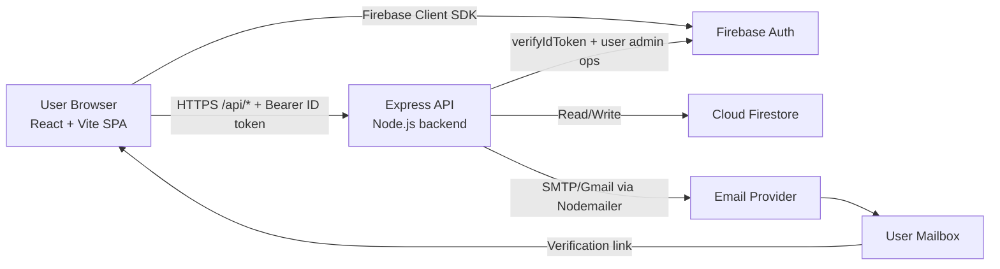
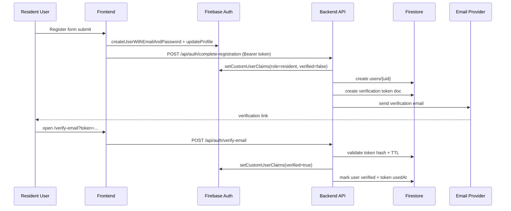

# OneGapo System Architecture

## 1. Purpose
OneGapo is a role-based city management platform with three main actor groups:
- Residents: self-register, verify email, access resident pages.
- Staff: operate within assigned branches and permissions.
- Admins: manage branches, roles, and user lifecycle.

The architecture uses a React SPA frontend, an Express API backend, Firebase Authentication for identity, and Firestore for operational data.

## 2. High-Level Architecture

## 3. Runtime Components

### 3.1 Frontend (React SPA)
Primary responsibilities:
- Route rendering and role-gated navigation.
- Sign-in/sign-up/password-reset via Firebase Client SDK.
- API access with Firebase ID token in `Authorization: Bearer <token>`.
- Verification UX for residents and token-based verification callback handling.

Key modules:
- `AuthContext`: tracks auth state, claims, and account verification state.
- `ProtectedRoute`: route-level policy enforcement for auth, roles, and resident verification.
- `AdminPanel`: branch/role/staff/user management UI.
- `StaffPanel`: branch-scoped staff management + permission-gated tools.

### 3.2 Backend (Express API)
Primary responsibilities:
- Verify Firebase ID tokens.
- Enforce role-based access control via custom claims.
- Orchestrate user provisioning and Firestore writes.
- Manage verification-token lifecycle and account verification sync.
- Send outbound transactional emails (verification and password setup/reset).

Layers:
- Routes: endpoint grouping (`/api/auth`, `/api/admin`, `/api/admin/branches`, `/api/admin/roles`).
- Middleware: `verifyToken`, `requireAdmin`, `requireStaffOrAdmin`.
- Controllers: business logic per bounded area (auth/admin/branches/roles).
- Services: email transport and verification-token domain logic.

### 3.3 External Services
- Firebase Authentication:
  - Primary identity provider.
  - Stores custom claims (`role`, `branchId`, `permissions`, `verified`, etc.).
- Firestore:
  - Application operational records (`users`, `branches`, `roles`, `emailVerificationTokens`).
- SMTP/Gmail (Nodemailer):
  - Delivers verification and password-related emails.

## 4. Access Control Model

### 4.1 Identity and Claims
The backend trusts Firebase-issued ID tokens after verification. Authorization is claim-driven:
- `role`: `resident`, `staff`, `admin`
- `branchId`, `location`, `entityType`: scope context for staff/admin operations
- `permissions`: fine-grained staff capability flags
- `verified`: application-level verification state

### 4.2 Policy Enforcement
- Unauthenticated: blocked by `verifyToken` for protected endpoints.
- Admin-only endpoints: guarded by `requireAdmin`.
- Staff/Admin shared endpoints: guarded by `requireStaffOrAdmin`.
- Frontend route guard:
  - Resident accounts require verified state for app access.
  - Staff/Admin bypass resident verification gate but remain role-scoped.

## 5. Data Architecture

### 5.1 Firestore Collections
- `users`
  - Profile + role + branch metadata + verification status.
- `branches`
  - Branch master records (`name`, `type`, audit fields).
- `roles`
  - Custom role templates mapped to allowed permission set.
- `emailVerificationTokens`
  - Token hash, TTL, issued/used timestamps, email linkage.

### 5.2 Data Ownership
- Source of truth for login identity: Firebase Auth user record.
- Source of truth for application metadata and relationships: Firestore.
- Source of truth for authorization checks at request time: Firebase claims (validated server-side).

## 6. Key Business Flows

### 6.1 Resident Registration and Verification

### 6.2 Admin/Staff Provisioning
- Admin can create branch, role, and staff users globally.
- Staff can create staff users only within their own `branchId` scope.
- Provisioning writes both:
  - Firebase Auth user + claims
  - Firestore `users` document
- Email workflows send:
  - Verification link
  - Password setup/reset link (for no-password staff creation patterns)

### 6.3 Session and API Access
- Frontend obtains ID token from Firebase client SDK.
- API call includes bearer token.
- Backend verifies token using Firebase Admin SDK.
- Controller executes only if middleware role checks pass.

## 7. API Surface (Domain-Oriented)
- Auth domain (`/api/auth`): registration completion, verification status, resend verification, verify token.
- Admin users domain (`/api/admin`): create/list/update/delete users, resend verification, branch staff create/list.
- Branch domain (`/api/admin/branches`): CRUD branches.
- Role domain (`/api/admin/roles`): CRUD custom roles.

## 8. Security Architecture
- Authentication: Firebase-signed JWT ID tokens.
- Authorization: backend-enforced RBAC and scoped claims.
- Token hardening:
  - Email verification uses random token + SHA-256 hash storage.
  - Token TTL expiration and used-token handling.
- CORS:
  - Restricted to configured frontend origin (or localhost pattern in dev).
- Secrets/config:
  - Firebase Admin credentials from env JSON or file path.
  - Email credentials from env.

## 9. Deployment and Environments

### 9.1 Development
- Frontend on Vite dev server (`:5173`) with `/api` proxy to backend (`:5000`).
- Backend as Express process with `.env` configuration.

### 9.2 Production Baseline
- Frontend: static hosting/CDN.
- Backend: Node runtime behind HTTPS reverse proxy or managed container platform.
- Firestore + Firebase Auth: managed by Firebase project.
- Email transport: managed SMTP/Gmail account with monitored deliverability.

## 10. Operational Considerations
- Logging:
  - Backend currently logs errors and email delivery issues to stdout.
  - Recommend structured logs with request IDs.
- Consistency:
  - Some operations update both Auth claims and Firestore docs; partial failure handling should be monitored.
- Auditing:
  - Existing fields like `createdBy` and `updatedBy` are a good base; extend to immutable audit logs if needed.
- Rate limits/abuse controls:
  - Consider adding API throttling and brute-force protection at gateway level.

## 11. Scalability Notes
- Current architecture scales reasonably for moderate city workloads because:
  - Auth is offloaded to Firebase.
  - Firestore provides managed horizontal scaling.
  - Backend is stateless and can scale out behind a load balancer.

Future scale improvements:
- Introduce queue-based email dispatch for resilience.
- Add caching for frequently-read reference data (roles/branches).
- Add read-model endpoints for analytics instead of loading all users in admin dashboards.

## 12. Architecture Decision Snapshot
- Chosen stack optimizes for speed of delivery and low ops burden.
- Firebase Auth + claims simplifies RBAC without building custom identity.
- Firestore schema is pragmatic and aligned to current admin workflows.
- Express API acts as policy and orchestration layer rather than data-heavy compute layer.

---
This document reflects the architecture implemented in the current codebase and can be used as the foundation for a C4 model, deployment diagram, and security threat model in later iterations.
