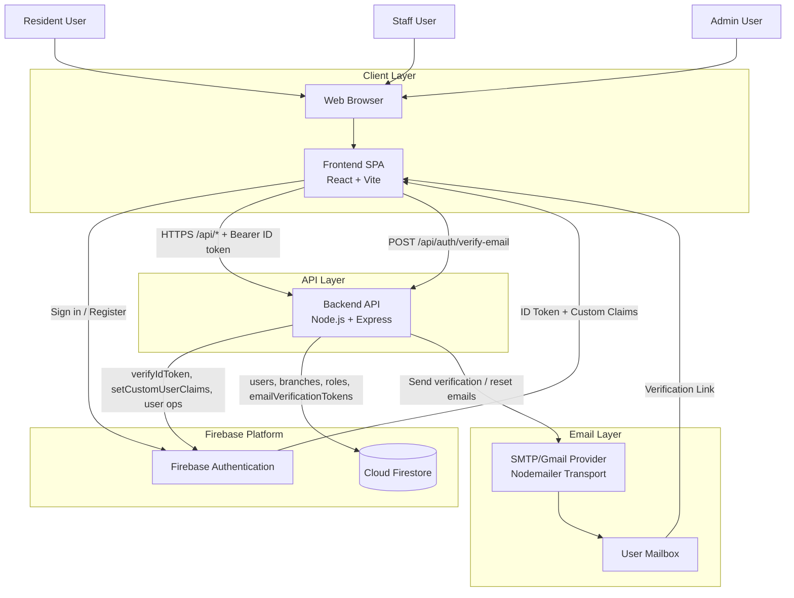

# OneGapo System Architecture Diagram

```mermaid
flowchart TB
  %% External actors
  Resident[Resident User]
  Staff[Staff User]
  Admin[Admin User]

  %% Client and edge
  Browser[Web Browser]
  Frontend[Frontend SPA\nReact + Vite]
  API[Backend API\nNode.js + Express]

  %% Core managed services
  FirebaseAuth[Firebase Authentication]
  Firestore[(Cloud Firestore)]
  Email[SMTP/Gmail Provider\nNodemailer Transport]
  Mailbox[User Mailbox]

  %% Routing/UI auth path
  Resident --> Browser
  Staff --> Browser
  Admin --> Browser
  Browser --> Frontend

  %% Auth + token lifecycle
  Frontend -->|Sign in / Register| FirebaseAuth
  FirebaseAuth -->|ID Token + Custom Claims| Frontend

  %% API calls with token
  Frontend -->|HTTPS /api/* + Bearer ID token| API
  API -->|verifyIdToken, setCustomUserClaims, user ops| FirebaseAuth

  %% Data operations
  API -->|users, branches, roles, emailVerificationTokens| Firestore

  %% Email verification + password setup
  API -->|Send verification / reset emails| Email
  Email --> Mailbox
  Mailbox -->|Verification Link| Frontend
  Frontend -->|POST /api/auth/verify-email| API

  %% Logical boundaries
  subgraph Client Layer
    Browser
    Frontend
  end

  subgraph API Layer
    API
  end

  subgraph Firebase Platform
    FirebaseAuth
    Firestore
  end

  subgraph Email Layer
    Email
    Mailbox
  end
```
